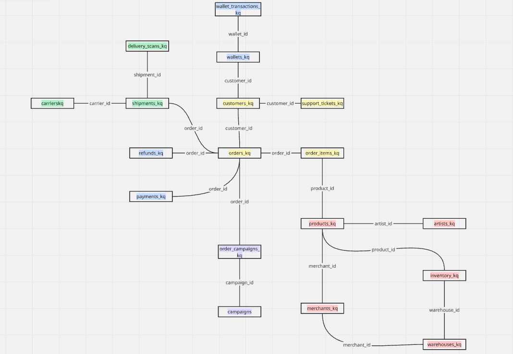
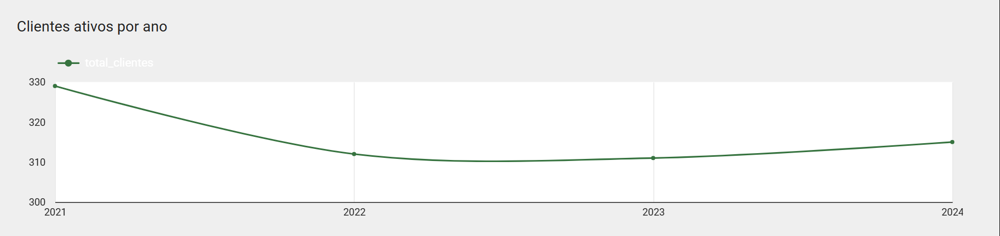
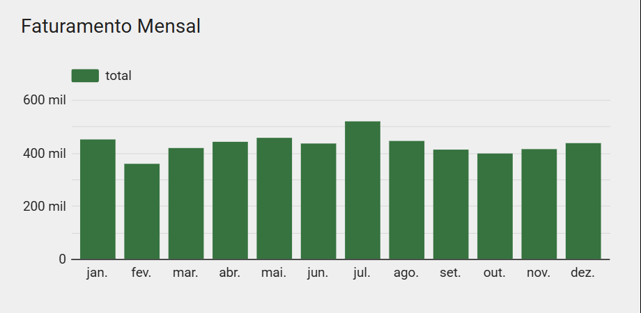
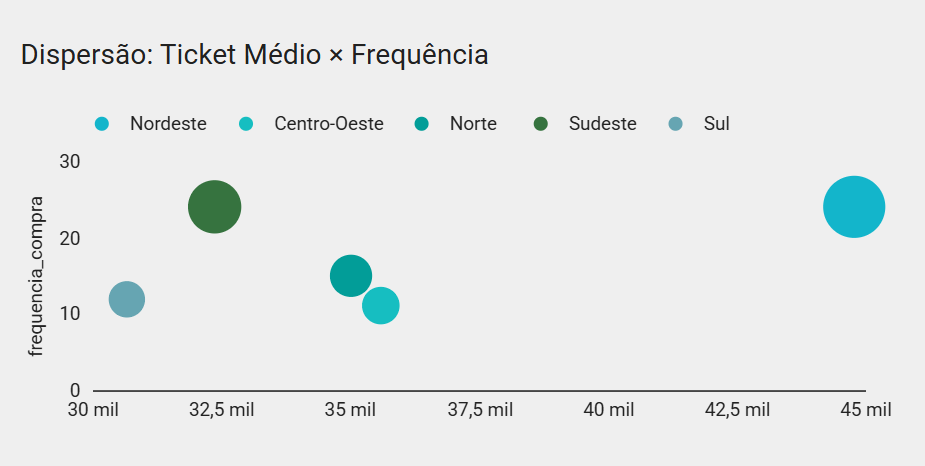
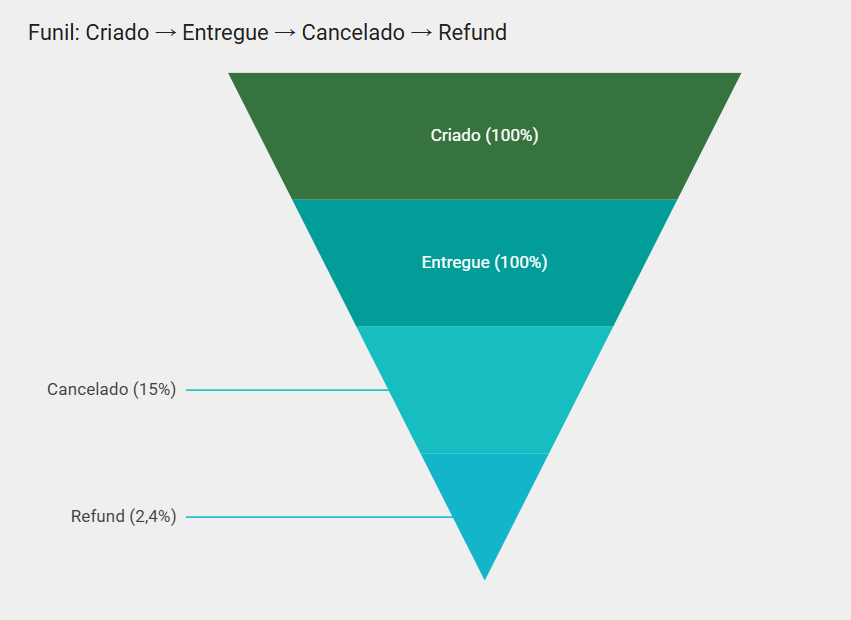
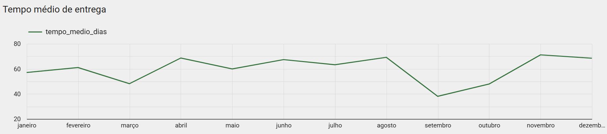

# FinLogArts — BI & Analytics
*(BigQuery + Looker Studio)*

Projeto de portfólio com base educacional (`meli-bi-data.TMP.*`) para demonstrar **SQL (BigQuery)**, **modelagem de métricas** e **dashboard (Looker Studio)**.

## 🔗 Links
- **Dashboard (Looker Studio):** https://lookerstudio.google.com/u/0/reporting/2ef16139-c9fe-48fa-9a90-f62e3603fcd7/page/ZBcYF  (público)
- **One-pager (PDF):** ./docs/onepager.pdf

##  Como reproduzir

1. **Abrir BigQuery (Standard SQL).**

2. **Ajustar parâmetros** nos arquivos de `/docs/sql`:  
   - Editar a CTE `params` no topo com `dt_ini` e `dt_fim`.  
   - Usar `regiao` se desejar filtrar por região.

3. **Executar as queries na ordem**:  
   - `01_base_quality_checks.sql` → checagens de qualidade (datas negativas, nulos, duplicidades).  
   - `02_views_kpis.sql` → fonte única dos KPIs de cabeçalho.  
   - `03_views_funil.sql` → funil *Criado → Enviado → Entregue → Cancelado → Refund* por ano/região.  
   - `04_views_sla_logistica.sql` → SLA mensal (cap 0–120 dias) + métricas p50/p90.

4. **Conectar no Looker Studio** e gerar os 5 visuais principais.

5. **Exportar resultados**:  
   - Prints do painel → `./docs/prints/`  
   - One-pager executivo → `./docs/onepager.pdf`

##  Visuais do painel (5)
- `clientes_ativos.png` — Clientes ativos por ano.
- `faturamento_mensal_2024.png` — Faturamento mensal (2024).
- `ticket_regiao.png` — Ticket médio por região.
- `funil_pedidos.png` — Funil de pedidos.
- `sla_mensal.png` — Tempo médio de entrega (mês a mês).

## Checklist de Qualidade (aplicado no projeto)

- **Datas negativas**: casos onde `ship_date < order_date` ou `delivery_date < ship_date`.  
  *Ação:* investigar inconsistências e descartar registros inválidos.  

- **Nulos críticos**: campos essenciais (`order_id`, `customer_id`, datas) não podem ser nulos.  
  *Ação:* corrigir upstream ou filtrar para evitar distorções.  

- **Duplicidade de pedidos**: cada `order_id` deve ser único.  
  *Ação:* aplicar DISTINCT e validar chaves primárias.  

- **SLA**: limitar análise entre *0–120 dias*.  
  *Ação:* remove outliers e garante métricas realistas.  

- **Refunds**: considerados apenas no mesmo ano da entrega.  
  *Ação:* assegura coerência temporal entre receita e devoluções.

##  Schema do Dataset

O projeto utiliza as seguintes tabelas principais:

- `orders_kq`
- `customers_kq`
- `order_items_kq`
- `payments_kq`
- `refunds_kq`
- `shipments_kq`
- `carrierskq`
- `products_kq`
- `inventory_kq`
- `warehouses_kq`
- `merchants_kq`

Diagrama relacional:

## Decisões de modelagem (racionais)

- **Refunds**: considerados apenas em pedidos *Entregues* e no *mesmo ano da entrega*.  
  *Motivo:* garante coerência temporal e evita dupla contagem de receitas negativas.  

- **SLA**: aplicado cap de *0–120 dias*.  
  *Motivo:* remove outliers operacionais (ex.: erros de data) sem distorcer a média.  

- **KPIs**: todos centralizados em `02_views_kpis.sql`.  
  *Motivo:* fonte única reduz inconsistências entre visuais e garante padronização.  

- **Filtros**: `ano` e `regiao` definidos diretamente na camada SQL.  
  *Motivo:* assegura consistência entre gráficos e melhora performance no Looker Studio.

### Miniaturas
### Clientes ativos por ano

Tendência levemente negativa entre 2021–2023, com recuperação em 2024.  
→ Insight: reforçar aquisição de novos clientes para sustentar crescimento.

### Faturamento Mensal

Sazonalidade evidente: julho tem pico acima de 600k, enquanto fevereiro é o menor mês.  
→ Insight: planejar estoque e campanhas promocionais alinhadas à sazonalidade.

### Ticket médio por região

Diferenças regionais claras — Sudeste apresenta maior ticket médio.  
→ Insight: ajustar precificação e mix por região.

### Funil de pedidos

Perda significativa entre “Criado” e “Entregue” (~12% cancelados).  
→ Insight: revisar motivos de cancelamento antes da expedição.

### SLA mensal

Entrega geralmente dentro de 30 dias, mas picos em meses específicos.  
→ Insight: investigar atrasos e renegociar com transportadoras.

## Queries SQL
- [Clientes ativos por ano](docs/sql/clientes_ativos_ano.sql)  
- [Retenção (Cohort)](docs/sql/retencao_cohort.sql)  
- [Funil de pedidos](docs/sql/funil_pedidos.sql)  
- [Ticket médio por região](docs/sql/ticket_medio_regiao.sql)  
- [Top 10 produtos](docs/sql/top10_produtos.sql)  
- [Ranking clientes por região (Top 5)](docs/sql/ranking_clientes_regiao.sql)  
- [Faturamento mensal](docs/sql/faturamento_mensal.sql)  
- [Pagamentos por método](docs/sql/pagamentos_metodo.sql)  
- [SLA mensal](docs/sql/sla_mensal.sql)  
- [SLA por transportadora](docs/sql/sla_transportadora.sql)  
- [% Entregue vs. % Cancelado](docs/sql/kpi_cabecalho_entregue_cancelado.sql)  

